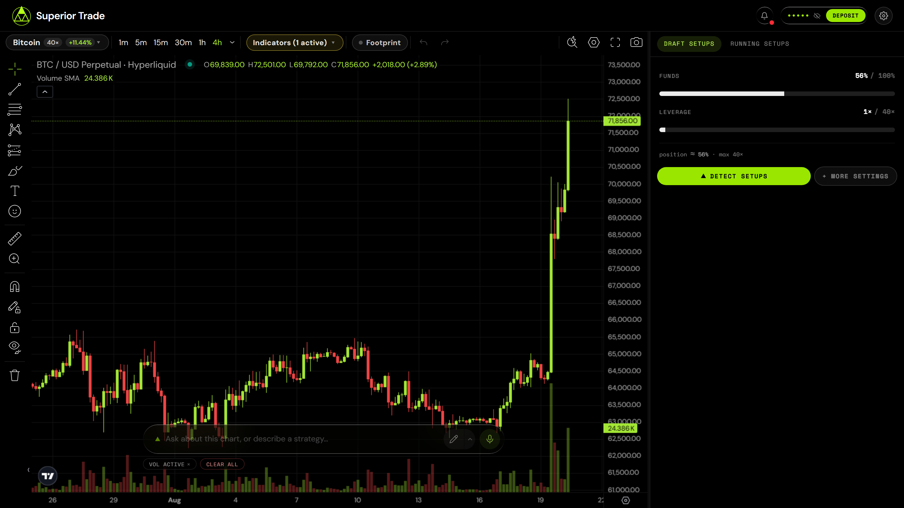
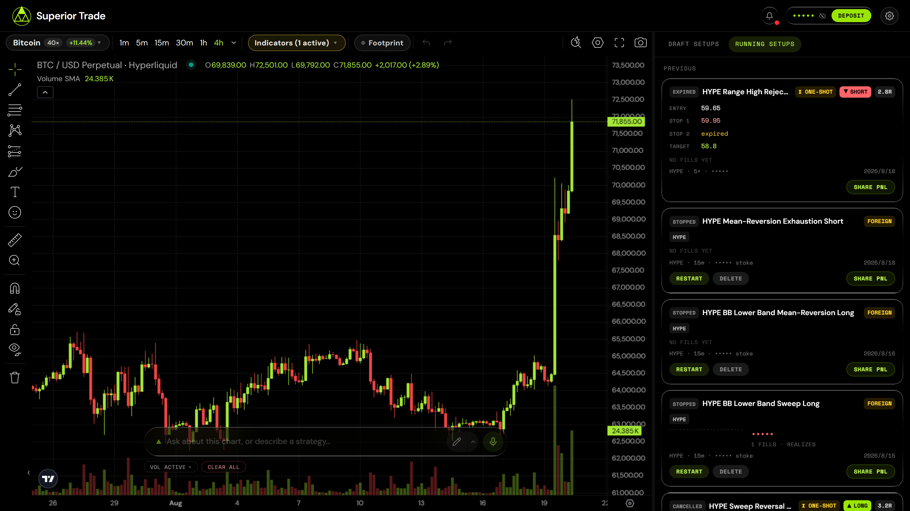

<div align="center">


### Literally draw where you think the market is going.<br>Get a fully managed trade back.

An AI trading terminal for Hyperliquid. Sketch your read straight onto the chart; the
agent turns it into a real setup with entry, stop and target, ranks more setups beside
it, and writes the Freqtrade strategy that trades the one you pick — refusing the unsafe
ones on the way.

Run it yourself, or use the hosted build at
[terminal.superior.trade](https://terminal.superior.trade).

[](LICENSE) [](https://nodejs.org) [](https://nextjs.org)



<sub>You draw the path. It comes back with a plan, a rating, and a deploy button.</sub>

</div>

---

## The loop

**1. You draw a level and ask.**

> *"HYPE keeps rejecting off this line. Is there a mean-reversion trade here on the 15m?"*

**2. The agent reads your actual chart** — your drawings, the visible range, the
indicators you have plotted, and a screenshot of it — and answers with a plan:

| | |
|---|---|
| Entry | 38.20 — close crossing back above the band |
| Stop | 36.90 *(−3.4%)* |
| Target | 41.05 *(+7.5%)* |
| Invalidation | 15m close below 36.50 |

**3. You say deploy.** It writes the strategy, and the validator reads it before
anything else does:

```python
def populate_entry_trend(self, dataframe: DataFrame, metadata: dict) -> DataFrame:
    dataframe.loc[
        (
            (dataframe['volume'] > 0) &                      # no signals on dead candles
            (dataframe['close'] < dataframe['bb_lower']) &
            (dataframe['rsi'] < 40) &
            (dataframe['close'] > dataframe['ema_50'])
        ),
        'enter_long'
    ] = 1
```

**4. It runs.** Live PnL, an auto-stop timer if the edge is time-boxed, and an inbox
that tells you when something happened.

<div align="center">



<sub>The other half — what you have deployed, what state it is in, and the controls.</sub>

</div>

## Hosted or self-hosted

The hosted build at [terminal.superior.trade](https://terminal.superior.trade) is this
repository with a login in front of it. Both talk to the same
[Superior Trade API](https://api.superior.trade/docs) and trade the same accounts, so the
choice is about who runs the process, not about what you get.

Running your own copy means your keys stay on your machine and every prompt and safety
rule is yours to change. It also means no login (see [SECURITY.md](SECURITY.md)),
withdrawals that stop one hop short (see [docs/withdrawals.md](docs/withdrawals.md)), and
getting your own TradingView access before the chart will build.

## What actually stops you losing money

The interesting part of this repo is not that a model writes Python. It is what happens
between "the model wrote it" and "it is trading your funds".

Every generated strategy is parsed and checked before it can be submitted. A failure
does not surface as a stack trace — the complaints go back to the model, which rewrites
the strategy, and the loop repeats. A few of the rules, in the validator's own words:

- `code uses shift(-N) — that reads FUTURE candles (lookahead bias); backtests lie and live behaves differently`
- `config.stoploss must be negative — freqtrade stops are always negative, for shorts too`
- `trailing_stop_positive ... at 10x looks unscaled (it is leveraged PnL, like stoploss) — multiply the price % by leverage`
- `entry conditions must include the (dataframe['volume'] > 0) guard so signals never fire on dead candles`
- `startup_candle_count is too low — use ≥ 3× the longest indicator lookback`
- `code uses .iloc[...] inside populate_* — per-row indexing behaves differently live vs backtest`

Most of these came from strategies that reached production and cost real money. Each one
is a scar. [docs/strategy-pipeline.md](docs/strategy-pipeline.md) has the full set and
explains the repair loop.

## Features

| | |
|---|---|
| **Chart** | TradingView Advanced Charts, Hyperliquid + Lighter datafeeds, order-flow footprint, liquidation heatmap, tier-ranked indicators |
| **Agent** | Reads your drawings and a screenshot of the chart; draws back — levels, zones, trendlines, channels, fibs |
| **Setups** | Scan a chart for plans, or design one in conversation. Entry, stop, target, invalidation, confidence tier |
| **Strategies** | Freqtrade code generation, deterministic safety validation, automatic repair, historical backtests |
| **Execution** | Live deployments, bracket orders for one-shot plans, position sizing, leverage caps, time-boxed auto-stop |
| **Funds** | Deposit, transfer between accounts, consolidate idle wallets, withdraw |
| **Self-hosted only** | Embedded Postgres, no login, no telemetry unless you turn it on, every prompt editable |

Two differences worth knowing before you choose. Self-hosted has **no login** — the API
key is the identity — and it withdraws **one hop**, from Hyperliquid to your Superior
wallet; the final hop to a wallet you hold the keys for needs a signed-in session, and
[docs/withdrawals.md](docs/withdrawals.md) explains why that is deliberate.
[The hosted terminal](https://terminal.superior.trade) does both.

<a id="run-it-yourself"></a>

## Run it yourself

**Two keys.** Nothing else to sign up for.

```bash
git clone https://github.com/Superior-Trade/trading-terminal.git
cd trading-terminal
npm install
cp .env.example .env.local     # add the two keys below
npm run setup:charts           # TradingView — see the note
npm run dev                    # → http://localhost:3200
```

| | Where |
|---|---|
| `SUPERIOR_TRADE_API_KEY` | [superior.trade](https://superior.trade) → Account → API keys |
| `OPENROUTER_API_KEY` | [openrouter.ai/keys](https://openrouter.ai/keys) |

No database to provision, no account to create, no login screen. An embedded Postgres
writes to `./.data/` and migrates itself on first boot.

`.env.example` documents 38 variables. Those two are the only ones without a working
default.

> [!IMPORTANT]
> **The chart needs TradingView's approval, and that takes a day or two.**
> Advanced Charts is free but not redistributable, so we cannot ship it. Apply at
> [tradingview.com/advanced-charts](https://www.tradingview.com/advanced-charts/); once
> your GitHub account is granted the repository, `npm run setup:charts` pulls it in.
> Until then the build stops with instructions. See
> [docs/charting-library.md](docs/charting-library.md).

## Money

This places real orders with real funds by design.

- **Read the strategies before you deploy them.** The validator catches the mistakes we
  know about, not the ones we don't.
- **Start on testnet** (`NEXT_PUBLIC_HL_NETWORK=testnet`) or with an amount you would
  shrug at.
- **A backtest is not a prediction.** Neither is the agent's reasoning.
- **Self-hosted has no login** — anyone who can reach the port can trade with your key.
  Fine on localhost, dangerous anywhere else. See [SECURITY.md](SECURITY.md).
  (The hosted terminal authenticates properly; this only applies to a copy you run.)

Not investment advice. No promise of profit. You are responsible for what you run.

## Documentation

| | |
|---|---|
| [docs/architecture.md](docs/architecture.md) | How a sentence becomes a running bot |
| [docs/strategy-pipeline.md](docs/strategy-pipeline.md) | Generation, validation, repair, logging |
| [docs/charting-library.md](docs/charting-library.md) | Installing TradingView Advanced Charts |
| [docs/withdrawals.md](docs/withdrawals.md) | How money gets out, and how far this repo takes it |
| [docs/self-hosting.md](docs/self-hosting.md) | Configuration, databases, running it somewhere else |

## Development

```bash
npm run dev           # dev server on :3200
npm test              # unit tests
npm run test:e2e      # 19 checks against a running server, nothing mocked
npm run check-types
npm run lint
npm run preview       # render README.md the way GitHub will, images and all
```

`npm run test:e2e` drives the whole app — boot, database, the Superior Trade API, market
data, real model calls. It never spends money: deploying and withdrawing are the two
irreversible actions and it stops short of both.

`evals/` holds the agent evaluations, including the suites a prompt change should be
measured against.

## Contributing

Issues and pull requests welcome — [CONTRIBUTING.md](CONTRIBUTING.md). The code that
moves money gets read closely; bring a test.

What merges here also ships to the hosted build — it runs this repository.

## License

[Apache-2.0](LICENSE) © Superior Trade. TradingView's Advanced Charts is licensed
separately by TradingView and is not included here — see [NOTICE](NOTICE) for that and
the other third-party notices.
