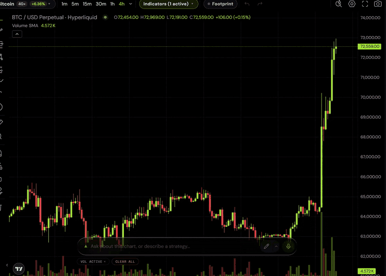
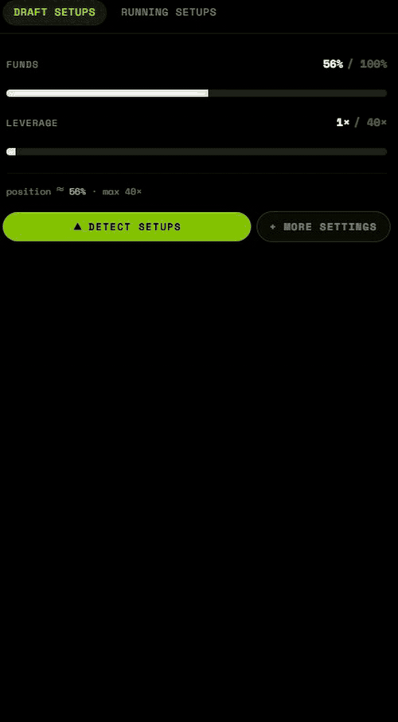
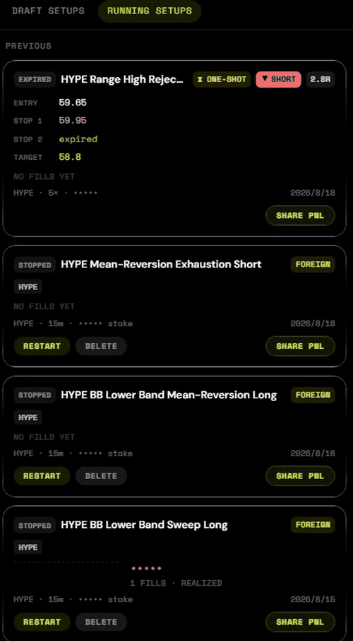

<div align="center">


### Literally draw where you think the market is going.<br>Get a fully managed trade back.

An AI trading terminal for Hyperliquid. Sketch your read straight onto the chart; the
agent turns it into a real setup with entry, stop and target, ranks more setups beside
it, and writes the Freqtrade strategy that trades the one you pick — refusing the unsafe
ones on the way.

Run it yourself, or use the hosted build at
[terminal.superior.trade](https://terminal.superior.trade).

[](LICENSE) [](https://nodejs.org) [](https://nextjs.org) [](https://discord.gg/aVZR8cCxcR)


<sub>You draw the path. It comes back with a plan, a rating, and a deploy button.</sub>

</div>

---

> [!TIP]
> **Have an agent instead of a mouse?** The terminal is for humans. If you want your
> agent trading directly — no UI, no clone — hand it one line:
> `Read https://superior.trade/SKILL.md and register.`
> Works from Claude Code, OpenClaw, Codex and Cursor. Pointing a coding agent at this
> repository instead? [AGENTS.md](AGENTS.md).

## News

- **2026-08-21** — A fresh clone now runs without TradingView: the bundled
  [Lightweight Charts](https://github.com/tradingview/lightweight-charts) preview boots
  first, Advanced Charts drops in later (`npm run setup:charts`).
- **2026-08** — The validator's rule set and repair loop are written up in
  [docs/strategy-pipeline.md](docs/strategy-pipeline.md). Every rule exists because a
  strategy once reached production without it.

## The loop

**1. You draw a level and ask.**

> *"HYPE keeps rejecting off this line. Is there a mean-reversion trade here on the 15m?"*



**2. The agent reads your actual chart** — your drawings, the visible range, the
indicators you have plotted, and a screenshot of it — and answers with a plan:

| | |
|---|---|
| Entry | 38.20 — close crossing back above the band |
| Stop | 36.90 *(−3.4%)* |
| Target | 41.05 *(+7.5%)* |
| Invalidation | 15m close below 36.50 |



**3. You say deploy.** It writes the strategy, and the validator reads it before
anything else does:

```python
def populate_entry_trend(self, dataframe: DataFrame, metadata: dict) -> DataFrame:
    dataframe.loc[
        (
            (dataframe['volume'] > 0) &                      # no signals on dead candles
            (dataframe['close'] < dataframe['bb_lower']) &
            (dataframe['rsi'] < 40) &
            (dataframe['close'] > dataframe['ema_50'])
        ),
        'enter_long'
    ] = 1
```

**4. It runs.** Live PnL, an auto-stop timer if the edge is time-boxed, and an inbox
that tells you when something happened.



<div align="center">


<sub>The other half — what you have deployed, what state it is in, and the controls.</sub>

</div>

## Hosted or self-hosted

The hosted build at [terminal.superior.trade](https://terminal.superior.trade) is this
repository with a login in front of it. Both talk to the same
[Superior Trade API](https://api.superior.trade/docs) and trade the same accounts, so the
choice is about who runs the process, not about what you get.

Running your own copy means your keys stay on your machine and every prompt and safety
rule is yours to change. It also means no login (see [SECURITY.md](SECURITY.md)),
withdrawals that stop one hop short (see [docs/withdrawals.md](docs/withdrawals.md)), and
getting your own TradingView access before the chart will build.

## What actually stops you losing money

The interesting part of this repo is not that a model writes Python. It is what happens
between "the model wrote it" and "it is trading your funds".

Every generated strategy is parsed and checked before it can be submitted. A rejection
is not an error you see — the complaints go back to the model, which rewrites the
strategy, and the loop repeats until it passes. Some of what gets caught:

| The check | What it prevents |
|---|---|
| No `shift(-N)` in `populate_*` | Reading future candles. The backtest looks superb and live behaves nothing like it |
| Stops are leverage-scaled | A 3.7% price stop written raw at 10× is ten times tighter than intended. The bot churns fees until the balance is gone |
| Entries gate on `volume > 0` | Signals firing on dead candles |
| `startup_candle_count` ≥ 3× the longest lookback | Indicators are NaN live, so the bot silently never trades — the pod stays healthy and nothing happens |
| TA-Lib tuples indexed by position | `bollinger['upperband']` raises on every candle. One live strategy did this for ten hours while its entry condition was met seven times |

Most of these are scars: they exist because a strategy reached production without them.
[docs/strategy-pipeline.md](docs/strategy-pipeline.md) has the full set and explains the
repair loop.

## Features

| | |
|---|---|
| **Chart** | TradingView Advanced Charts (or the bundled Lightweight Charts preview), Hyperliquid + Lighter datafeeds, order-flow footprint, liquidation heatmap, tier-ranked indicators |
| **Agent** | Reads your drawings and a screenshot of the chart; draws back — levels, zones, trendlines, channels, fibs |
| **Setups** | Scan a chart for plans, or design one in conversation. Entry, stop, target, invalidation, confidence tier |
| **Strategies** | Freqtrade code generation, deterministic safety validation, automatic repair, historical backtests |
| **Execution** | Live deployments, bracket orders for one-shot plans, position sizing, leverage caps, time-boxed auto-stop |
| **Funds** | Deposit, transfer between accounts, consolidate idle wallets, withdraw |
| **Self-hosted only** | Embedded Postgres, no login, no telemetry unless you turn it on, every prompt editable |

<a id="run-it-yourself"></a>

## Run it yourself

**Two keys.** Nothing else to sign up for.

```bash
git clone https://github.com/Superior-Trade/trading-terminal.git
cd trading-terminal
npm install
cp .env.example .env.local     # add the two keys below
npm run dev                    # → http://localhost:3200
```

| | Where |
|---|---|
| `SUPERIOR_TRADE_API_KEY` | [superior.trade](https://superior.trade) → Account → API keys |
| `OPENROUTER_API_KEY` | [openrouter.ai/keys](https://openrouter.ai/keys) |

No database to provision, no account to create, no login screen. An embedded Postgres
writes to `./.data/` and migrates itself on first boot.

`.env.example` documents 38 variables. Those two are the only ones without a working
default.

> [!NOTE]
> **It starts on the preview chart.** TradingView's Advanced Charts is free but not
> redistributable, so it is not in this repository and a fresh clone runs
> [Lightweight Charts](https://github.com/tradingview/lightweight-charts) instead —
> Apache-2.0, bundled, nothing to request.
>
> Everything works on it except the two things it has no concept of: **drawing on the
> chart yourself**, and indicator studies. To get those, request Advanced Charts at
> [tradingview.com/advanced-charts](https://www.tradingview.com/advanced-charts/) (free,
> a day or two) and run `npm run setup:charts`. The build tells you which chart it
> picked. Full comparison: [docs/charting-library.md](docs/charting-library.md).

## Money

This places real orders with real funds by design. The validator above catches the
mistakes we know about, not the ones we don't — so read what the agent writes before you
deploy it, and start on testnet (`NEXT_PUBLIC_HL_NETWORK=testnet`) or with an amount you
would shrug at.

A backtest is not a prediction, and neither is the agent's reasoning. Not investment
advice, no promise of profit, and you are responsible for what you run.

## Documentation

| | |
|---|---|
| [docs/architecture.md](docs/architecture.md) | How a sentence becomes a running bot |
| [docs/strategy-pipeline.md](docs/strategy-pipeline.md) | Generation, validation, repair, logging |
| [docs/charting-library.md](docs/charting-library.md) | Installing TradingView Advanced Charts |
| [docs/withdrawals.md](docs/withdrawals.md) | How money gets out, and how far this repo takes it |
| [docs/self-hosting.md](docs/self-hosting.md) | Configuration, databases, running it somewhere else |

## Development

```bash
npm run dev           # dev server on :3200
npm test              # unit tests
npm run test:e2e      # 19 checks against a running server, nothing mocked
npm run check-types
npm run lint
npm run preview       # render README.md the way GitHub will, images and all
```

`npm run test:e2e` drives the whole app — boot, database, the Superior Trade API, market
data, real model calls. It never spends money: deploying and withdrawing are the two
irreversible actions and it stops short of both.

`evals/` holds the agent evaluations, including the suites a prompt change should be
measured against.

## Contributing

Issues and pull requests welcome — [CONTRIBUTING.md](CONTRIBUTING.md), and
[AGENTS.md](AGENTS.md) if you are pointing a coding agent at this. The code that moves
money gets read closely; bring a test.

What merges here also ships to the hosted build — it runs this repository.

## License

[Apache-2.0](LICENSE) © Superior Trade. TradingView's Advanced Charts is licensed
separately by TradingView and is not included here — see [NOTICE](NOTICE) for that and
the other third-party notices.

---

<div align="center">

[](https://star-history.com/#Superior-Trade/trading-terminal&Date)

<sub>If this repo is useful, a star helps other traders find it.</sub>

</div>
